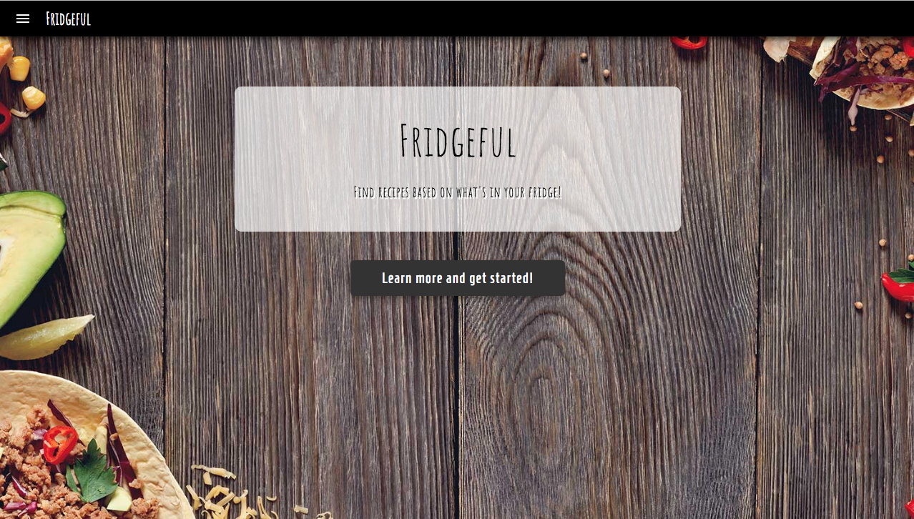
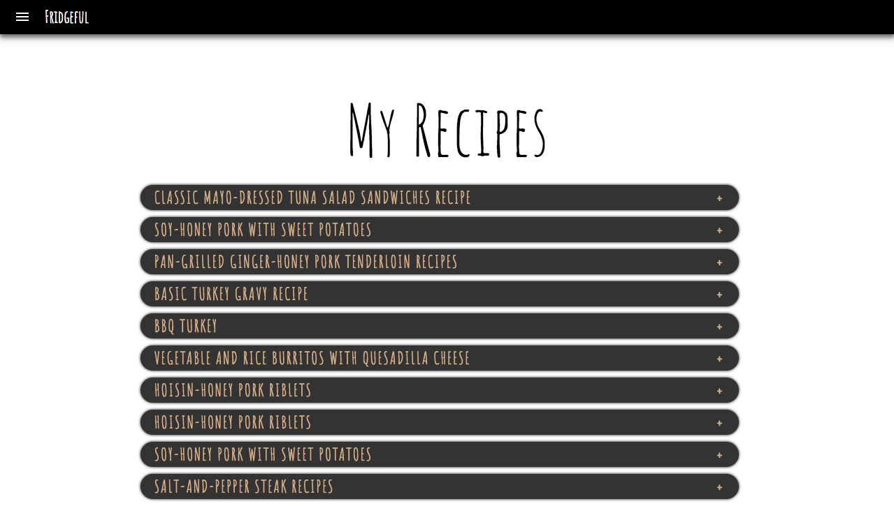
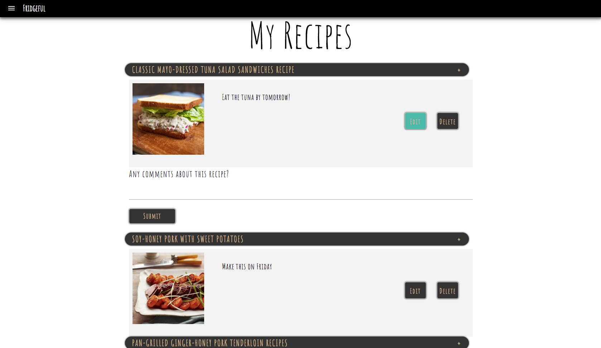

# Fridgeful

A responsive web application that pulls data from Edamam Recipe API and allows users to search for recipes with specific ingredients. The app allows users to search for several recipes with the ingredients left in their fridge. 

## Introduction
Fridgeful is a recipe app that goes above and beyond a simple food app. The app allows users to create an account and search over 2 million recipes by diets, calories, and nutrition ranges. Fridgeful will allow users to search with any ingredient and write/edit their own comments on their saved recipe. The goal of Fridgeful is to help users work together toward decreasing the amount of food waste in the world. Food is simply too good to waste. Create an account and get started with Fridgeful. 

## Live Demo
You can find the live demo of Fridgeful at: 
https://fridgeful.netlify.com

## Screenshots
Home Display Page

About Section

Mission/Goal Section + Footer

SignIn Page + Registration Page

Recipe Search Page + Results

Saved Recipe List

Edit Recipe Page

## Technology

Front End
<li> React  
<li> Redux  
<li> HTML5  
<li> CSS3  
<li> JavaScript  

BackEnd
<li> Node.js  
<li> Express.js  
<li> MongoDB  
<li> Mongoose 

Security and Authentication
<li> Passport.js  
<li> bcrypt.js  
<li> JSON Web Token 

Deployment, Version Control and Cloud Hosting
<li> GitHub  
<li> Netlify  
<li> Heroku  
<li> mLab 

## Client Side Code
You can find the client side code at:  
https://github.com/wjypark94/fridgeful-client

## Server Side Code
You can find the server side code at:  
https://github.com/wjypark94/fridgeful-api

## Authors/Contributors
<li> William Park - (https://github.com/wjypark94)